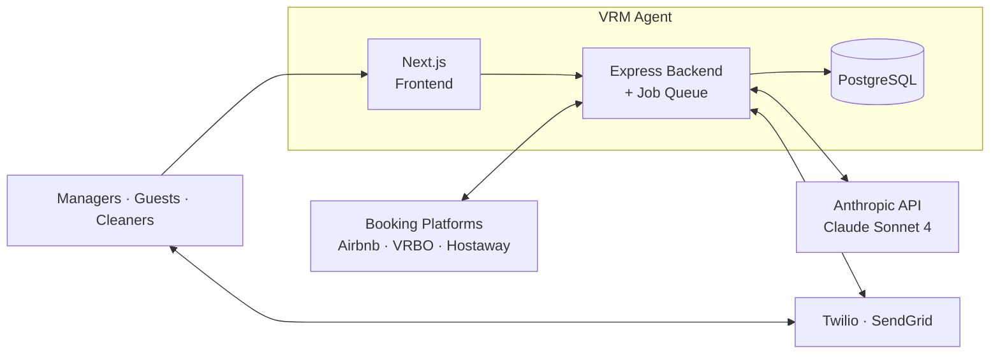

# VRM Agent

**An AI-powered operational assistant for vacation rental property managers.**

This is the public portfolio repository for VRM Agent — the backend of an AI-driven SaaS that autonomously handles guest communication, cleaning coordination, and maintenance intake across Airbnb, VRBO, and direct bookings. It replaces the four to six disconnected tools a property manager juggles today. **Built solo in three weeks, testing included.**

---

## System overview



---

## Project status

Pre-launch. Backend complete and tested. Frontend complete but held in a private repository. Integration layer paused during migration from Airbnb's discontinued public API to Hostaway.

---

## What this repository contains

This is the **backend** of VRM Agent, published as a portfolio artifact. It is production-grade architecture, originally built for a single-manager MVP designed to scale to multi-tenant SaaS.

**In this repository:**
- Full backend source (`src/`) — API routes, scheduled jobs, middleware, encryption layer, external integrations
- Database schema and migrations (`prisma/`) — PostgreSQL on Supabase
- Three planning documents — `PRD.md`, `ARCHITECTURE.md`, `TICKETS.md`
- Pre-launch QA report (`QA_REPORT.pdf`) — 849 automated tests across backend and frontend, 40/40 end-to-end integration assertions, zero failures

**Deliberately held back:**
- Frontend (Next.js / React) — held until the integration layer is unpaused so dashboards reflect real data
- Screens specification document — held alongside the frontend
- Environment secrets — never published; variable structure is shown in `.env.example`

---

## Tech stack

| Layer | Technology | Hosting |
|---|---|---|
| Backend runtime | Node.js + Express + TypeScript | Railway |
| Frontend (private) | Next.js + React + TypeScript | Vercel |
| Database | PostgreSQL with Row Level Security | Supabase |
| ORM | Prisma | — |
| Job queue | pg-boss (Postgres-native) | Co-located with database |
| AI model | Claude Sonnet 4 via Anthropic API | — |
| SMS | Twilio | — |
| Email | SendGrid | — |
| Authentication | JWT in HTTP-only cookies; OAuth 2.0 for booking platforms | — |
| Encryption | AES-256-GCM, application-layer, on sensitive columns | — |
| Observability | Sentry (errors); Pino + Logtail (structured logs) | — |

---

## Build approach

VRM Agent was built by orchestrating AI-driven development tools against detailed specifications, architectural decisions, and atomic implementation tickets. The `PRD.md`, `ARCHITECTURE.md`, and `TICKETS.md` files in this repository are the actual planning artifacts used during the build — spec-first methodology, not documentation written after the fact.

---

## Repository structure and where to start reading

```
vrm-agent-backend/
├── ARCHITECTURE.md         Technical design and infrastructure decisions
├── PRD.md                  Product requirements and feature specifications
├── TICKETS.md              62 implementation tickets with acceptance criteria
├── QA_REPORT.pdf           Pre-launch QA report — 849 tests, 40/40 E2E, 0 failures
├── .env.example            Environment variable structure (values stripped)
├── .gitignore
├── jest.config.ts
├── package.json
├── package-lock.json
├── tsconfig.json
├── prisma/                 Database schema and migrations
└── src/                    Backend source code and tests
```

**For a fast read (about 10 minutes):**
1. `PRD.md` Section 1 — what the product is and why
2. `ARCHITECTURE.md` Section 1 — the tech stack decisions and rationale
3. A sample ticket from `TICKETS.md` (T-001 for project setup; T-049 for a feature ticket) — see how features were scoped
4. `QA_REPORT.pdf` — Sections 1, 3, and 8 — the executive summary, test results, and sign-off

**For a thorough read:** all four documents in the order above, then the source code starting with `src/index.ts`.

---

## About the builder

Built by **Samira Maadallah** — freelance AI Builder based in Florida, US. Six years in QA engineering and test automation; ISTQB-certified; previously led a 15-person end-to-end testing team at ATOS for La Poste Group. Builds production software end-to-end by combining systems architecture, spec discipline, and AI-orchestrated development.

**Profile:** [Freelancer.com/u/samiramaad](https://www.freelancer.com/u/samiramaad)

---

© 2026 Samira Maadallah. Published for portfolio review only; not licensed for reuse or redistribution.
